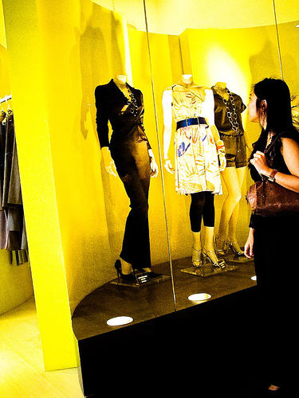

# Project_Image_Captioning
With the help of this project, machine can generate its own captions related to the image. The model uses Flickr8k dataset for training data and uses LSTM for training and CNN for extracting the image features.

## Dataset
This dataset contains 8000 images and there are 5 captions for each image.

## The Model made contains:

1) Image model: for reducing image of high dimensions into selected features.  
2) Language model: for creating output as embeddings to reduce complexity of model. 
3) Final model: which will concatenate results of both this model and will use LSTM layer and Time Distributed layer for doing final_predicttions.
  
  
## One of example of final prediction:

A woman is looking at some mannequins in a window display .

